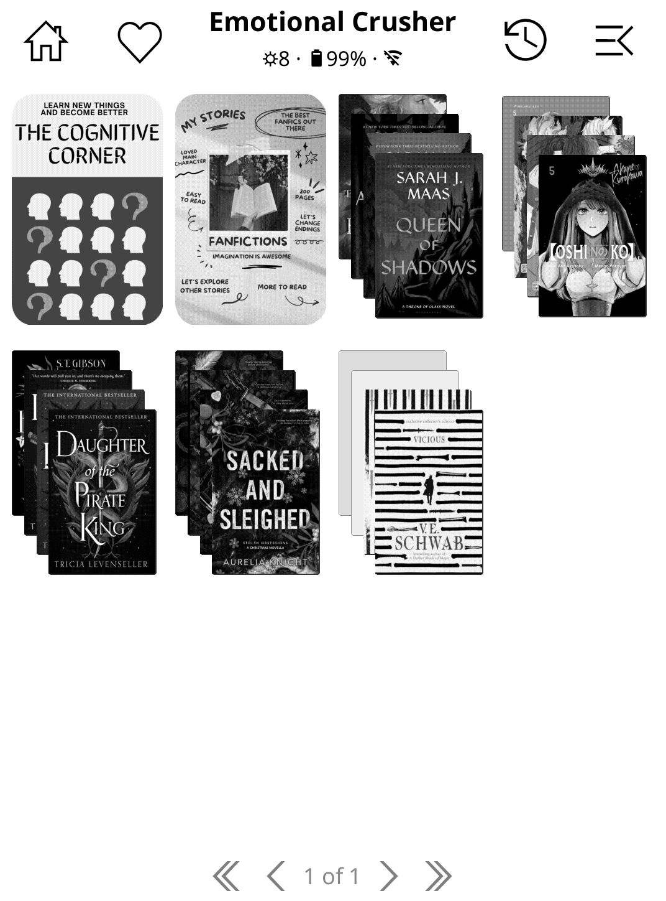

# KOReader User Patches by advokatb

A collection of user patches for KOReader that enhance functionality and customization.

**Tested on:** KOReader 2025.10 "Ghost" with Project: Title v3.5 and CoverBrowser plugin

## 🞂 How to install a user patch?

Please [check the guide here](https://koreader.rocks/user_guide/#L2-userpatches) for detailed installation instructions.

---

## 🞂 [2-smart-collections.lua](2-smart-collections.lua)

**Smart Collections** - Automatic collections based on metadata rules (author, date, tags, series, language, etc.)

### Features

- **Rule-based filtering**: Create collections automatically based on book metadata
- **Multiple operators**: equals, contains, starts with, ends with, not equals, not contains, greater than, less than, is empty, is not empty
- **Combined conditions**: Use AND (all rules must match) or OR (any rule must match)
- **Automatic updates**: Collections are automatically updated when books are added or modified
- **Smart folder scanning**: Automatically scans subfolders if no books found in root folder
- **Visual indicator**: Smart collections are marked with a 💡 icon

### Supported Metadata Fields

- **Authors** (multi-value) - Check against author names
- **Title** - Filter by book title
- **Series** - Filter by series name
- **Keywords** (multi-value) - Filter by tags/keywords
- **Language** - Filter by book language
- **Publication date** - Filter by publication date
- **Pages** (numeric) - Filter by page count
- **Reading status** - Filter by reading status (New, Reading, On hold, Finished)

### Installation

1. Copy `2-smart-collections.lua` to `koreader/patches/` folder
2. Restart KOReader

### Usage

1. **Create a collection** and connect at least one folder to it:
   - Go to **File Manager** → **Collections**
   - Create a new collection or use an existing one
   - Long-press on the collection → **Connect folders**
   - Select the folder(s) containing your books

2. **Make it a smart collection**:
   - Long-press on the collection in the collections list
   - Select **"Make smart collection"**

3. **Add rules**:
   - Select a field (e.g., Authors, Title, Series)
   - Choose an operator (e.g., contains, equals, starts with)
   - Enter the value to match (e.g., "Tolkien", "Harry Potter")
   - Add more rules if needed

4. **Choose how to combine rules**:
   - **All (AND)**: All rules must match
   - **Any (OR)**: At least one rule must match

5. **Save and test**:
   - Tap **"Save rules"** to save and update the collection
   - Or tap **"Test rules (update collection)"** to test without saving

### Example Rules

- **Authors contains "King"** - All books by authors containing "King"
- **Series equals "Harry Potter"** - All books in the Harry Potter series
- **Pages greater than 500** - All books with more than 500 pages
- **Language equals "en"** - All English books
- **Keywords contains "fantasy"** - All books tagged with "fantasy"
- **Reading status equals "Finished"** - All finished books
- **Reading status equals "Reading"** - All currently reading books
- **Reading status equals "On hold"** - All books on hold

### How It Works

- Smart collections automatically scan connected folders for books
- Each book's metadata is checked against the defined rules
- Books matching the rules are automatically added to the collection
- Books that no longer match are automatically removed
- Collections are updated when:
  - Rules are saved
  - Book metadata changes
  - Collection list is opened (background update)

### Notes

- Smart collections require at least one connected folder
- The patch uses BookInfoManager from CoverBrowser plugin (or loads it directly)
- Rules are stored in `koreader/settings/smart_collections.lua`
- KOReader's default “folder sync” (auto-adding every file from connected folders) is disabled for smart collections so that only rule-matching books remain
- Smart collections are marked with a 💡 icon in the collections list

### Debug logging

Verbose logging is disabled by default.  
If you need to troubleshoot rule matching, set:

```lua
local SMART_COLLECTIONS_DEBUG = true
```

near the top of `2-smart-collections.lua`.  
This enables detailed `logger.info` output (matched authors, rule checks, etc.). Remember to set it back to `false` once finished.

---

## 🞂 [2-pt-collections.lua](2-pt-collections.lua)

**Collections View for Project: Title** – adds a virtual “✪ Collections” folder inside the Project: Title file browser so you can browse KOReader collections as if they were directories.

### Features

- Adds a global `✪ Collections` entry to File Manager (Project: Title modes)
- Lists every KOReader collection as a folder with book counts
- Entering a collection shows all of its books; tapping opens the book instantly
- Works with both Grid and List layouts, respects sorting/filtering
- **Automatic display mode switching**: Applies your Project: Title "Collections display mode" setting when viewing collections, and restores your regular file browser mode when exiting
- Automatically refreshes whenever collections change
- Uses `icons/folder.collections.svg` if present (custom folder icon included in repo), or uses `icons/folder.collections.svg` if present, otherwise displays books from the collections identical to Project Title display (grid or stack)
- Each collection can have different png or svg icons by defining a `icons/_collection-name_.folder` SVG or PNG file.
  - e.g. `icons/Favorites.folder.png`

  

  

### Installation

1. Copy `2-pt-collections.lua` to `koreader/patches/`
2. Restart KOReader

### Usage

1. Open File Manager (Project: Title must be enabled)
2. In your home directory, tap the `✪ Collections` entry that appears at the top of the list
3. The view automatically switches to your configured "Collections display mode"
4. Pick a collection folder to see the books it contains
5. Tap a book to open it, or use KOReader's standard long-press actions
6. When you navigate out, the view automatically returns to your normal file browser display mode

**Tip:** You can configure the Collections display mode separately from your file browser mode in **Menu → Project: Title settings → Collections display mode** (Cover Grid, Cover List, Details List, or Filenames List).

### Configuration

- **Hide Favorites collection**: Edit `2-pt-collections.lua` and set `SHOW_FAVORITES_COLLECTION = false` (default) to hide the built-in Favorites collection from the Collections view. Set to `true` to show it.

### Notes

- The virtual entry is shown only at the top level (home folder) to keep subfolders uncluttered
- The virtual folder exists only inside the UI; no files/folders are created on disk

---

## 🞂 [2-custom-folder-fonts.lua](2-custom-folder-fonts.lua)

**Custom Folder Fonts** - Custom font selection for folder names in Project: Title plugin.

### Features

- **Custom Font Selection**: Choose any TrueType (.ttf) or OpenType (.otf) font from your `koreader/fonts/` folder
- **Font Size Adjustment**: Six size presets from Tiny to Huge
- **Automatic Font Discovery**: Recursively scans all fonts in `koreader/fonts/` including subdirectories
- **Works in All Modes**: Both Cover Grid (mosaic) and List view
- **Clean Integration**: Adds new "Folder Fonts" section in Advanced Settings

### Installation

1. Place your custom font files in `koreader/fonts/` folder on your device
   - You can organize fonts in subdirectories (e.g., `fonts/Atkinson_Hyperlegible/`)
   - Supported formats: `.ttf` and `.otf`

2. Copy `2-custom-folder-fonts.lua` to `koreader/patches/` folder

3. Restart KOReader

### Usage

1. Open **File Manager**
2. Tap **⚙ Settings** → **Project: Title settings**
3. Navigate to **Advanced settings** → **Folder Fonts**
4. Select **Custom font** and choose your desired font from the list
5. Optionally adjust **Font size** (Tiny to Huge)
6. Restart KOReader when prompted

### How It Works

This patch modifies the `ptutil.good_serif` and `ptutil.good_sans` font paths that Project: Title uses for rendering folder names. The font change applies to:

- Folder names in Cover Grid (mosaic) view
- Folder names in List view
- Both serif and sans-serif contexts

<details>
<summary><h3>Font Size Presets & Recommended Fonts</h3></summary>

### Font Size Presets

| Preset | Adjustment | Best For |
|--------|------------|----------|
| Tiny | -4 | Maximum density, small screens |
| Small | -2 | Slightly more compact |
| Default | 0 | Standard Project: Title size |
| Large | +2 | Better readability |
| Extra Large | +4 | High visibility |
| Huge | +6 | Maximum readability |

### Recommended Fonts

#### Highly Readable Fonts
- **Atkinson Hyperlegible** - Designed for low vision readers
- **OpenDyslexic** - Optimized for dyslexia
- **Lexend** - Improves reading proficiency

#### Clean Sans-Serif Fonts
- **Inter** - Modern, excellent at small sizes
- **Source Sans 3** - Adobe's workhorse
- **Roboto** - Google's Material Design font

#### Elegant Serif Fonts
- **Source Serif 4** - Pairs with Source Sans
- **Crimson Pro** - Classic book typography
- **Literata** - Designed for e-readers

### Settings Storage
- Font path: `custom_folder_font` in BookInfoManager
- Size adjustment: `custom_folder_font_size` in BookInfoManager

</details>

**Note:** This patch only affects folder names in Project: Title. It does not change:
- Book titles
- UI fonts
- Reader fonts
- Footer text (path display at bottom)

---

## 🞂 [2-cyrillic-transliteration-reverter.lua](2-cyrillic-transliteration-reverter.lua)

**Cyrillic Transliteration Reverter** - Automatically converts transliterated text back to Cyrillic for folder names displayed by Project: Title plugin in file manager only.

### Features

- **Automatic conversion**: Detects and converts transliterated Russian text back to Cyrillic script
- **Comprehensive rules**: Based on ISO 9 (GOST 7.79-2000), ALA-LC, and common transliteration patterns
- **File manager only**: Only affects folder names in file manager, not other menus
- **Smart detection**: Only processes text that looks like transliterated Russian
- **Virtual collections support**: Excludes virtual Collections folder from transliteration
- **Proper sorting**: Folders are sorted by their Cyrillic (transliterated) names, ensuring correct alphabetical order

### Installation

1. Copy `2-cyrillic-transliteration-reverter.lua` to `koreader/patches/` folder
2. Restart KOReader

### Usage

The patch works automatically - no configuration needed. When Calibre sends books with transliterated folder names (like "Briendon Sandierson" instead of "Брендон Сандерсон"), the patch will automatically detect and convert transliterated Russian text back to Cyrillic in the file browser while keeping the original folder structure intact.

### Examples

The patch automatically converts:
- `Briendon Sandierson` → `Брендон Сандерсон`
- `Dжордж Оруелл` → `Джордж Оруэлл`
- `Pom Iu Dzhin` → `Пом Ю Джин`
- `Dozory` → `Дозоры`
- `Portaly` → `Порталы`
- `Romany` → `Романы`

### How It Works

The patch automatically:
1. **Detects transliterated Russian text** using common patterns (ch, sh, zh, ya, yu, etc.)
2. **Converts using standard transliteration rules**:
   - Multi-character patterns: ch→ч, sh→ш, zh→ж, ya→я, yu→ю, etc.
   - Single character patterns: a→а, b→б, v→в, g→г, etc.
3. **Preserves folder structure** (keeps trailing slashes for folders)
4. **Only processes text that looks like transliterated Russian** - English text is left unchanged
5. **Excludes virtual Collections folder** - The virtual Collections folder injected by `2-pt-collections.lua` is not transliterated
6. **Enables proper sorting** - Creates transliterated sort keys for folders, so they are sorted alphabetically by their Cyrillic names rather than Latin transliteration

### Sorting

The patch modifies KOReader's sorting functions to use transliterated (Cyrillic) names for sorting folders. This ensures that:
- Folders like "Briendon Sandierson" are sorted as "Брендон Сандерсон" in the correct Cyrillic alphabetical position
- All sorting modes (name, natural sorting, etc.) respect the transliterated order
- Mixed folders (some transliterated, some not) are sorted correctly